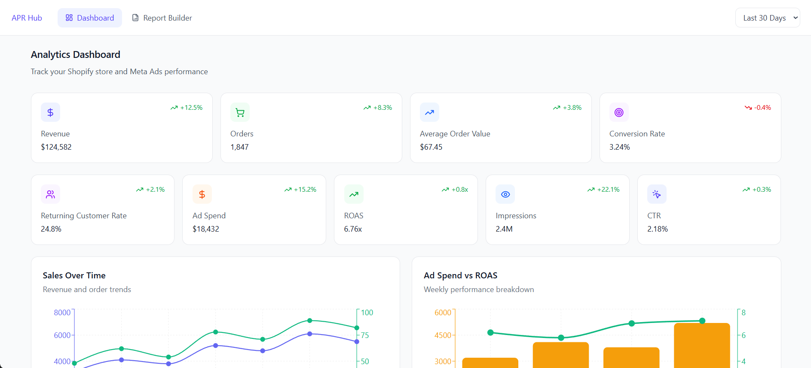

# APR Hub Dashboard Design

A modern and responsive dashboard UI built using **React**, **TypeScript**, **Vite**, and **Radix UI** components.  
This project is based on the APR Hub Dashboard Figma design.

---

## Tech Stack

- **React 18**
- **TypeScript**
- **Vite**
- **Radix UI**
- **Tailwind CSS**
- **Lucide Icons**
- **Recharts**
- **React Hook Form**

---

## 📦 Installation

Clone the repository and install dependencies:

```sh
git clone https://github.com/mulgeomkar/aprhub-analytic-dashboard
cd aprhub-analytic-dashboard
npm install

```

## Development

Start the development server:
```

npm run dev
```


The app will be available at:

http://localhost:5173

## Build for Production

Generate the optimized production build:
```

npm run build
```


## The output 



## 🎨 Figma Design  
[](https://www.figma.com/make/3UtrW2HRNB5RS2BNe4nH4D/APR-Hub-Dashboard-Design?node-id=0-1&t=MgH3X7cmu1EYeKPi-1)

## 🎨 Deployment

[](https://aprhub-analytic-dashboard.vercel.app/)

Visit the live site above. 


